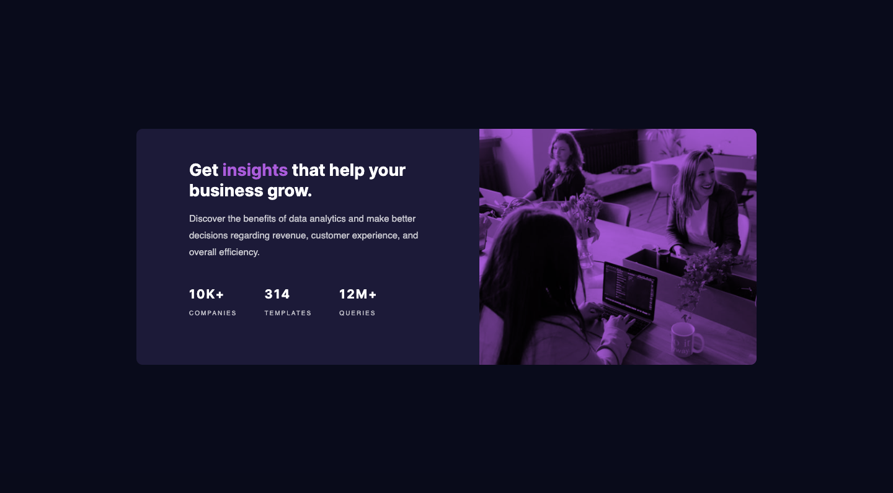
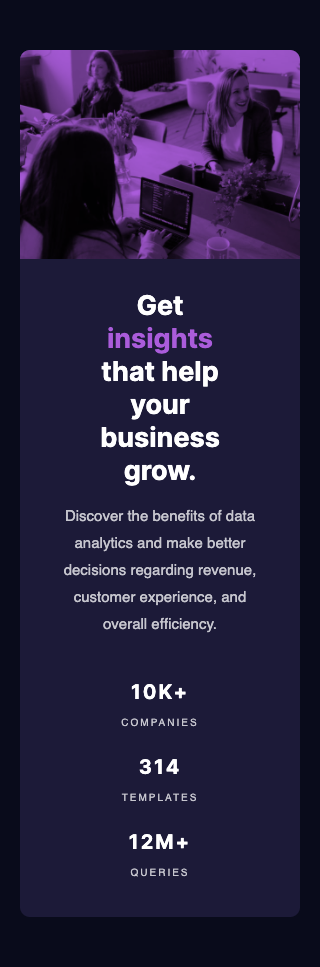

# Frontend Mentor - Stats preview card component solution

This is a solution to the [Stats preview card component challenge on Frontend Mentor](https://www.frontendmentor.io/challenges/stats-preview-card-component-8JqbgoU62). Frontend Mentor challenges help you improve your coding skills by building realistic projects. 

## Table of contents

- [Overview](#overview)
  - [The challenge](#the-challenge)
  - [Screenshot](#screenshot)
- [My process](#my-process)
  - [Built with](#built-with)
  - [What I learned](#what-i-learned)
  - [Continued development](#continued-development)
  - [Useful resources](#useful-resources)
- [Author](#author)

## Overview

### The challenge

Users should be able to:

- View the optimal layout depending on their device's screen size

### Screenshot

## My Process

### Built with

- HTML5 
- CSS custom properties
- Flexbox
- Mobile-first workflow

### What I learned

I started this project only hours after after completing a basic HTML, CSS, and Flexbox course and it's the first thing I've ever coded. Which taught me a couple things: 1: You guys weren't kidding. Google is the best resource and the only reason I was able to complete this. 2: There are so many different ways to center a div and no one agrees on the best way. 3: Coding is way harder than the tutorials make it seem.

This entire project was a struggle, and as it's my first, I decided to take a don't look back approach. As such, I've mixed margins and padding (still don't know when to use which when there isn't a border) and my code is probably a mess. Some code I implemented early on probably doesn't need to be there anymore since changing approach, but my aim was just to finish, not to make my code pretty.

A tutorial on Youtube for this specific challenge took around 30 minutes. It took me on and off 3 days. I had to remind myself that I'm a beginner with no prior coding experience, of course it's going to take me longer. With one project under my belt, and a lot of Googling, I'm more prepared to jump into my second project. 

### Continued development

Some things I used/learned in this project that I want to focus on improving on in the future: 
- Flexbox: You think you know Flexbox until you have to use it. I don't know Flexbox.
- CSS Variables: I didn't know this was a thing until I was already almost done with the project, but it's something I want to look into and use in future challenges.

### Useful resources

- [Image Overlay](https://stackoverflow.com/questions/36679649/how-to-add-a-color-overlay-to-a-background-image/36679903) - This resource helped me figure out how to do a cover overlay. I went with the third option, which introduced me to the background blending mode property. To give the DIV height/width, I populated it with the image in an img tag and then set its transparency to zero. Probably not the most efficient way to do it, but it worked. 

## Author

- Frontend Mentor - [@tlbodrick](https://www.frontendmentor.io/profile/tlbodrick)

